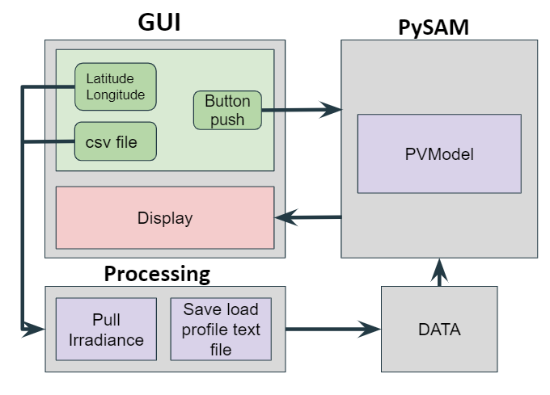

# Welcome to SolarSizer, test


Created by: Cassidy Quigley, Clayton Sasaki, Lindsey Taylor, Ning Wang

## Objective

The main objective of SolarSizer is to assist in the planning of small off-grid solar projects by creating a user friendly dashboard that takes in a location and load profile and returns an equipment list and cost estimate of a solar array capable of meeting the load profile.

## Structure



```
├── LICENSE
├── Procfile
├── README.md
├── doc
├── environment.yml
├── requirements.txt
├── runtime.txt
└── solarsizer
    ├── app.py
    ├── assets
    ├── data
    │   ├── README.md
    │   ├── irradiance.csv
    │   ├── load_profile_example.csv
    │   └── user_load_profile.txt
    ├── pysam
    │   ├── pysam_model.py
    │   └── pysam_utils
    │       └── run_pvmodel.py
    ├── tests
    └── utils
        ├── convert_load_profile.py
        └── pull_irradiance.py
```
## How to install and run SolarSizer

SolarSizer is set up using a conda environment to make sure the correct dependencies are installed. If you do not use conda you will need to make sure you have the packages listed in the environment.yml installed.

1. Clone the repository to your local machine: `git clone https://github.com/UW-Solar-GRID/SolarSizer.git`
2. Naviate to the base SolarSizer directory: `cd SolarSizer`
3. Set up the conda environment: `conda env create -f environment.yml`
4. Activate the conda environment with: `conda activate grid_ss`
5. Run the dashboard interface with: `python app.py` 
6. Copy the locally hosted URL from the command line to navigate to the dashboard interface.

## Contributions

We would love contributions to make SolarSizer a more accurate and comprehensive solar array model. If you would like to expand SolarSizer, please fork the repository, add your contribution, and generate a pull request. 

Some areas ripe for expansion: 
1) The software currently takes in a single day of load profile data, it would be more useful for build load profiles that can vary by week, month, or year. A simple start would be to allow a user to give a hourly txt file rather than the csv template.
2) Cost estimates given the suggested system specification. A simple way to do this would be to use the average or range of cost of the components.
3) The software currenly pulls in irradiance data from The National Solar Radiation Database hosted by the National Renewable Energy Laboratory using the Physical Solar Model (PSM) v3. In order to get csv files, data from only one year can be pulled. It would be better if another file type could be used (maybe json) and an average irradiance was calculated from multiple years.

This project operates under the [Contributor Code of Conduct](https://www.contributor-covenant.org/version/1/0/0/code-of-conduct/). A contributing guide for this project is under construction. 

## Additional Notes

1) For future use a few files are in the main directory but are not used.

- The files below are currently in the directory to deploy to Heroku; however the server is not set up.
  - Procfile
  - requirements.txt
  - runtime.txt

- Travis continous integration is not currently operational (can be set up later using the .travis.yml file)

2) All code is PEP8 compliant (pylint scores > 8)

## Acknowledgements

This python package has been created for CSE 583 under the guidence of Professor David Beck and Anant Mittal from the University of Washington. This package also uses modeling code developed by [GRID](https://github.com/UW-GRID/PV_sizing), a registered student orgainization at the University of Washington.
